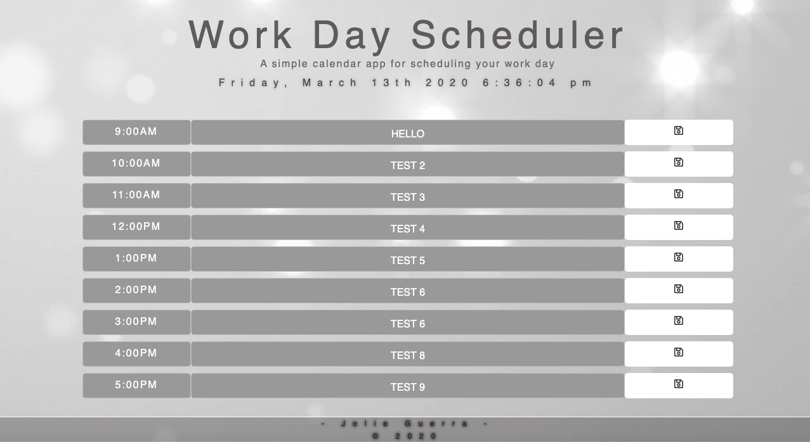
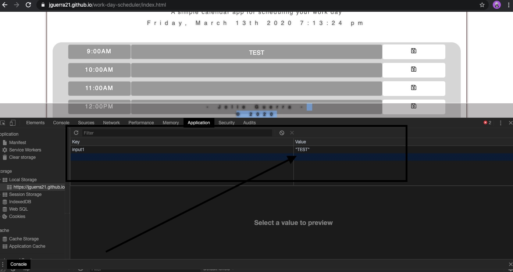

# work-day-scheduler
I have created a full functional work day planner using HTML, Bootstrap and Jquery. I have used different fonts, colors and style from the one provided to challenge my self along the way.
Also in this project i have used Moment.js to implement the time on top of the calendar as well when user schedule the time the coded colors come into action as they turn different colors.
I have challenged my self to used different styles, colors and functions so for future projects i can be ready to start from scratch.

Below are the instrctions provided to us in steps to make this scheduler fully functional.
Intructions ---->
GIVEN I am using a daily planner to create a schedule
WHEN I open the planner
THEN the current day is displayed at the top of the calendar

WHEN I scroll down
THEN I am presented with timeblocks for standard business hours

WHEN I view the timeblocks for that day
THEN each timeblock is color coded to indicate whether it is in the past, present, or future

WHEN I click into a timeblock
THEN I can enter an event

WHEN I click the save button for that timeblock
THEN the text for that event is saved in local storage

WHEN I refresh the page
THEN the saved events persist

Here is a screenshot of my finalwork below. Fully functional Work day Scheduler.

Local storage is saving all the content and if i refresh page events persist.

